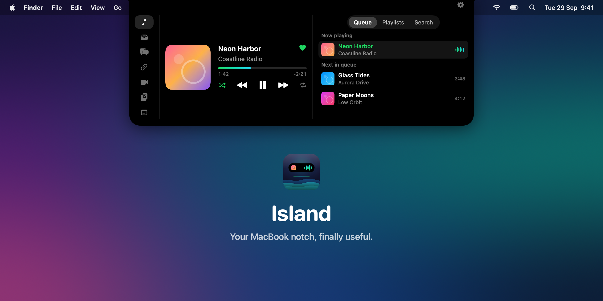
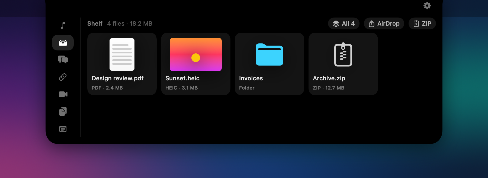
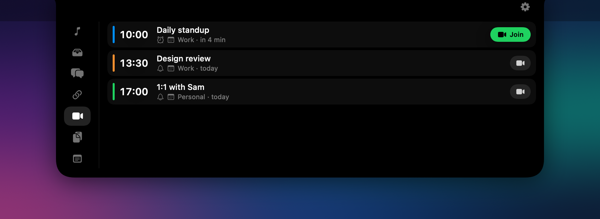
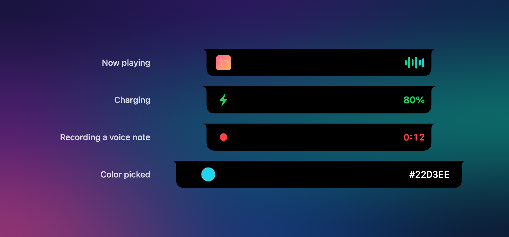

<p align="center">
  
</p>

<p align="center">
  <b>Island</b> turns the notch on your MacBook into a place for music, files, meetings and more.<br>
  Hover the notch to open it. No account, no analytics, nothing leaves your Mac.
</p>

<p align="center">
  <a href="../../releases/latest"><b>Download</b></a> ·
  <a href="#build-from-source">Build from source</a> ·
  <a href="README.ru.md">Русский</a>
</p>

---

## Features

**Music.** Spotify player with queue, your playlists and search. Pick a song inside a playlist
and it plays on from there. The equalizer takes its colors from the album cover, and can follow
the real sound.

**Shelf.** Drag files toward the notch and it opens right onto the shelf. Keep them there, then
drag them out one by one or all at once, send them over AirDrop, zip them, preview with Quick Look.

<p align="center"></p>

**Meetings.** Events from Calendar (iCloud, Google, Exchange) with their Zoom, Meet, Teams or
Telemost link found for you. Get a notification, or an alarm that opens the notch even in Focus.

<p align="center"></p>

**Live activities.** When the notch is closed it still shows what's going on.

<p align="center"></p>

**And also**
- Clipboard history in memory only, with on-device translation
- Notes and voice notes
- Quick launch for chats (Telegram, WhatsApp, iMessage) and links
- Charge limit for the battery through [batt](https://github.com/charlie0129/batt)
- Color picker anywhere on screen, three-finger middle click on the trackpad
- Keyboard control: <kbd>⌃</kbd><kbd>⌥</kbd><kbd>Space</kbd> opens the island, then digits switch tabs
- English and Russian, following the system or chosen in Settings

## Install

1. Download the latest `Island-<version>.dmg` from [Releases](../../releases/latest) and drag Island to Applications.
2. The app isn't notarized yet, so macOS stops it on first launch. Open **System Settings →
   Privacy & Security** and click **Open Anyway**.

Requires macOS 14 Sonoma or later. Works best on a MacBook with a notch; on other screens the
island sits at the top of the menu bar.

## Spotify

Island controls the Spotify app directly. The queue, playlists, search and likes use the Spotify
Web API with your own key:

1. Create an app at [developer.spotify.com/dashboard](https://developer.spotify.com/dashboard).
2. Add the redirect URI `http://127.0.0.1:43821/callback` and enable the Web API.
3. Paste the Client ID in Island's Settings and connect.

## Privacy

Everything stays on your Mac. Island only talks to Spotify when you connect it, and to the sites
you save as links to fetch their icons. Each permission is asked for only when you use the feature
that needs it:

| Permission | Used for |
| --- | --- |
| Accessibility | three-finger middle click |
| Automation → Spotify | playback control |
| Calendars | meetings from Calendar |
| Microphone | voice notes |
| System audio recording | the live equalizer (off by default, Spotify only, nothing recorded) |

## Build from source

Needs the Xcode Command Line Tools (`xcode-select --install`).

```sh
scripts/create-signing-identity.sh   # once: keeps permissions across rebuilds
./build.sh --run                     # build/Island.app, and launch it
scripts/make-dmg.sh                  # build/Island-<version>.dmg for Apple Silicon and Intel
```

## License

[MIT](LICENSE). Island is not affiliated with Apple or Spotify.
